# WAD Task Management Platform - Backend & API

RESTful API berbasis Node.js, Express, dan PostgreSQL untuk manajemen tugas. Aplikasi mendukung autentikasi JWT, komunikasi *real-time* menggunakan Socket.IO, serta modul **Milestone** untuk melacak progres proyek.

Proyek ini dikembangkan sebagai penugasan **Ujian Akhir Semester (UAS)** mata kuliah **Web Advanced Development 2 (WADV2)**, Program Studi S1 Sistem Informasi, Fakultas Ilmu Komputer, Universitas Cakrawala.

Implementasi mencakup seluruh materi praktikum **Week 1-9**, mulai dari pengembangan REST API, autentikasi dan otorisasi, React SPA, komunikasi *real-time* dengan WebSocket, hingga *deployment* ke VPS menggunakan Nginx, PM2, HTTPS, dan pipeline CI/CD dengan GitHub Actions.

## Project Links

- **Backend Repository:** https://github.com/fikriandrrhm19/wad-capstone
- **Frontend Repository:** https://github.com/fikriandrrhm19/wad-frontend
- **Live Application:** https://wad.fai.my.id
- **API Documentation (Swagger UI):** https://wad-api.fai.my.id/api/docs

## Struktur Proyek

```text
wad-capstone
├── src/
│   ├── config/          # Konfigurasi aplikasi
│   ├── controllers/     # Handler HTTP request
│   ├── middleware/      # Authentication, validation, authorization
│   ├── repositories/    # Akses data melalui Prisma ORM
│   ├── routes/          # Definisi endpoint REST API
│   ├── services/        # Business logic
│   ├── validators/      # Validasi request dengan Joi
│   ├── docs/            # Konfigurasi Swagger/OpenAPI
│   ├── socket.js        # Konfigurasi Socket.IO
│   └── index.js         # Entry point aplikasi
├── prisma/              # Schema, migration, dan seed database
├── media/               # Dokumentasi gambar dan screenshot
├── postman_collections/ # Postman Collection
├── package.json
└── README.md
```

## Fitur Utama Aplikasi

1. **RESTful API & Database**
   - Full CRUD untuk Task dan Milestone
   - Prisma ORM dengan PostgreSQL
   - Pagination, filtering, sorting, dan dokumentasi OpenAPI (Swagger)

2. **Authentication, Authorization & Security**
   - Hashing password dengan `argon2id`
   - JWT Access Token dan Refresh Token dengan *token rotation*
   - Validasi request menggunakan Joi
   - Role-Based Access Control (RBAC)
   - Security middleware: Helmet, CORS, Rate Limiting, dan Input Sanitization

3. **React Single Page Application**
   - React + Vite
   - React Router untuk *client-side routing*
   - Axios Interceptors untuk autentikasi dan *automatic token refresh*
   - Context API untuk manajemen state autentikasi, WebSocket, dan notifikasi

4. **Real-Time Communication**
   - Socket.IO untuk sinkronisasi data secara *real-time*
   - Broadcast perubahan Task dan Milestone
   - Online presence, toast notification, dan *automatic reconnection*

5. **Deployment & CI/CD**
   - Deployment ke VPS Ubuntu
   - PM2 sebagai process manager
   - Nginx Reverse Proxy dengan HTTPS (Let's Encrypt)
   - Pipeline CI/CD menggunakan GitHub Actions melalui SSH Deployment

6. **Milestone Module**
   - Manajemen Milestone beserta relasi Task
   - Perhitungan *progress* berdasarkan status Task
   - Update *progress bar* secara *real-time* tanpa *page refresh*


## Deployment Architecture

Aplikasi di-*deploy* di VPS menggunakan arsitektur *reverse proxy* dengan isolate service. Seluruh traffic-access publik diterima oleh Nginx, kemudian diteruskan ke service frontend/backend yang berjalan pada port lokal dengan PM2 sebagai *process manager*.

<p align="center">
  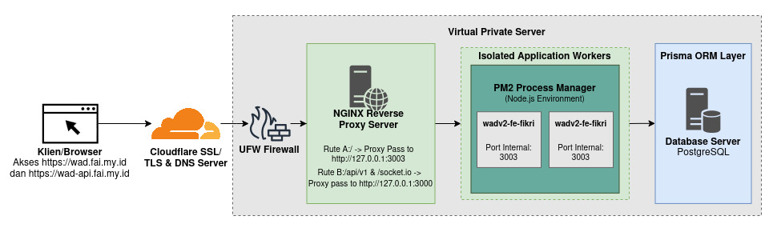
</p>

### Arsitektur Deployment

1. **Cloudflare**
   - Mengelola DNS dan pengaturan HTTPS untuk domain.
   - Seluruh traffic diteruskan ke VPS melalui port `80` dan `443`.

2. **Nginx Reverse Proxy**
   - Menerima seluruh request dari internet.
   - Meneruskan request `/` ke frontend (`127.0.0.1:3003`).
   - Meneruskan request `/api` dan `/socket.io` ke backend (`127.0.0.1:3000`), termasuk koneksi WebSocket.

3. **PM2 Process Manager**
   - Menjalankan dan memonitor proses aplikasi Node.js.
   - Melakukan *automatic restart* ketika aplikasi mengalami kendala.
   - Mengaktifkan kembali aplikasi secara otomatis setelah VPS me-*reboot*.

4. **Application Layer**
   - Frontend React berjalan di port `3003`.
   - Backend Express dan Socket.IO berjalan di port `3000`.
   - Seluruh port aplikasi hanya bisa diakses melalui Nginx dan tidak diekspos langsung ke publik.

5. **Database Layer**
   - Backend mengakses PostgreSQL melalui Prisma ORM.
   - Database hanya melakukan *binding* pada `localhost` sehingga tidak dapat diakses langsung dari internet.

## Socket.IO Events

Berikut adalah daftar event *real-time* yang digunakan untuk sinkronisasi data antara backend dan frontend.

| Event | Direction | Deskripsi | Payload |
| --- | --- | --- | --- |
| `task:created` | Server → Client | Task berhasil dibuat | `{ task }` |
| `task:updated` | Server → Client | Data Task berhasil diperbarui | `{ task }` |
| `task:deleted` | Server → Client | Task berhasil dihapus | `{ taskId }` |
| `milestone:created` | Server → Client | Milestone berhasil dibuat | `{ milestone }` |
| `milestone:updated` | Server → Client | Data Milestone atau progres diperbarui | `{ milestone }` |
| `milestone:deleted` | Server → Client | Milestone berhasil dihapus | `{ milestoneId }` |
| `notification` | Server → Client | Mengirim notifikasi *toast* ke pengguna | `{ type, title, message }` |
| `users:online` | Server → Client | Memperbarui jumlah pengguna yang sedang terhubung | `{ count }` |
| `token:refreshed`* | Client → Client | Menginformasikan bahwa *access token* telah diperbarui | `Custom DOM Event` |

> **Catatan:** `token:refreshed` bukan merupakan event Socket.IO. Event tersebut merupakan *Custom DOM Event* yang dipicu oleh Axios Interceptor setelah *refresh token* berhasil untuk menginisialisasi ulang koneksi WebSocket dengan *access token* terbaru.

## API Documentation

Swagger UI tersedia untuk mempermudah explore dan pengujian endpoint REST API.

<p align="center">
  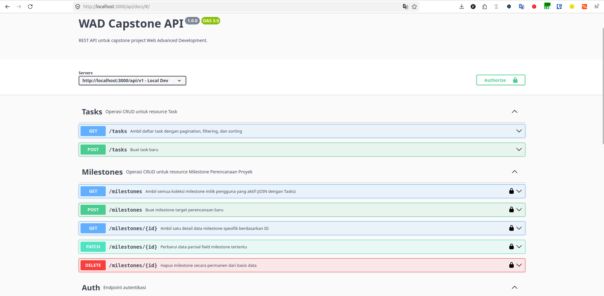
</p>

## Database Schema

Diagram berikut menggambarkan relasi antar entitas yang digunakan oleh aplikasi.

<p align="center">
  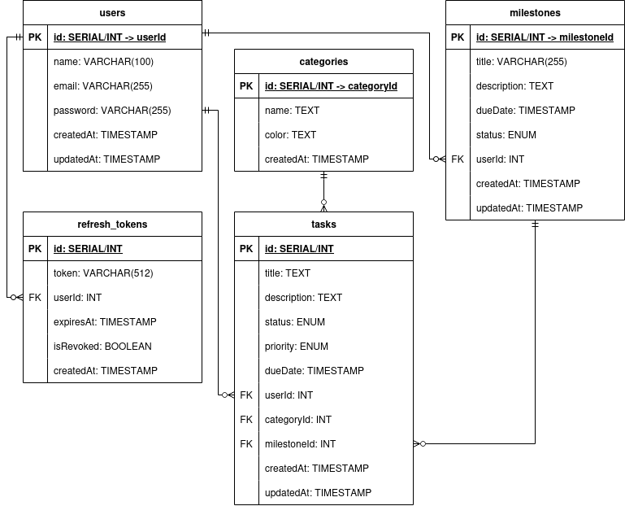
</p>

## Screenshots

Berikut beberapa tangkapan layar yang merepresentasikan fitur utama dari aplikasi.

### Frontend & Authentication

<p align="center">
  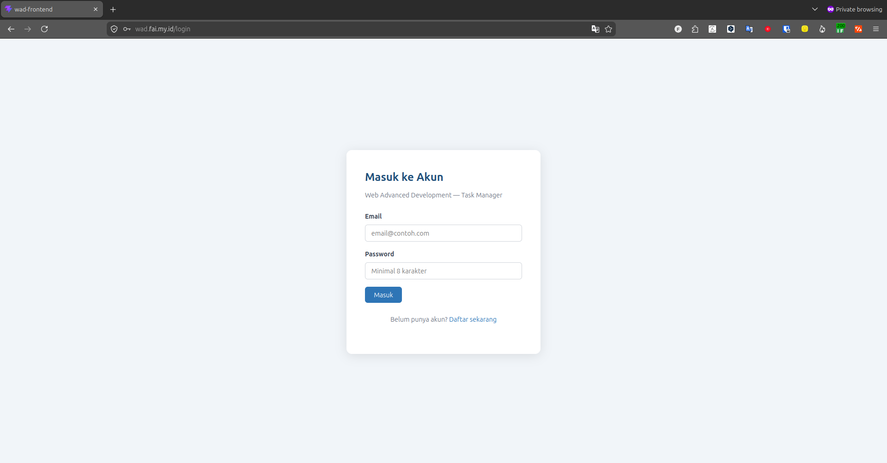
  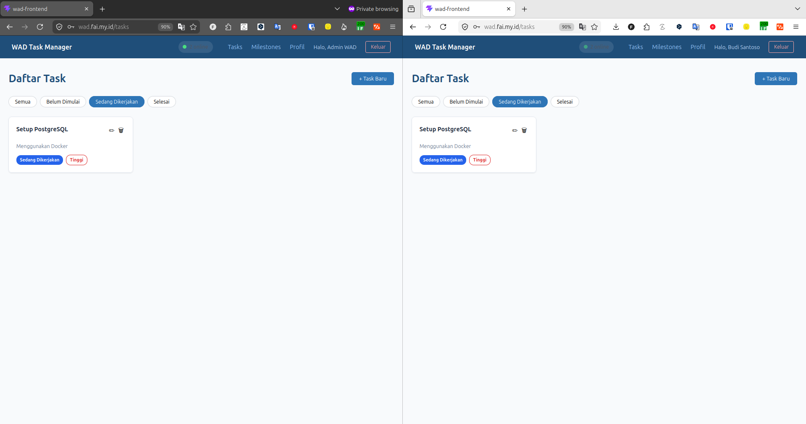
</p>

### Real-Time WebSocket

<p align="center">
  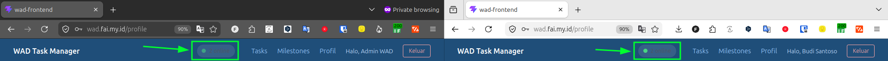
  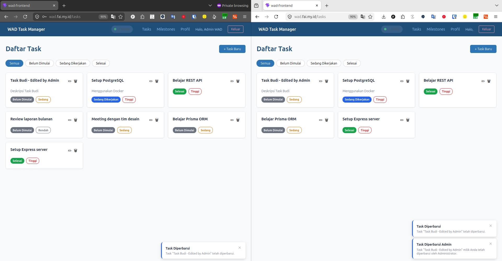
</p>

### Milestone Module

<p align="center">
  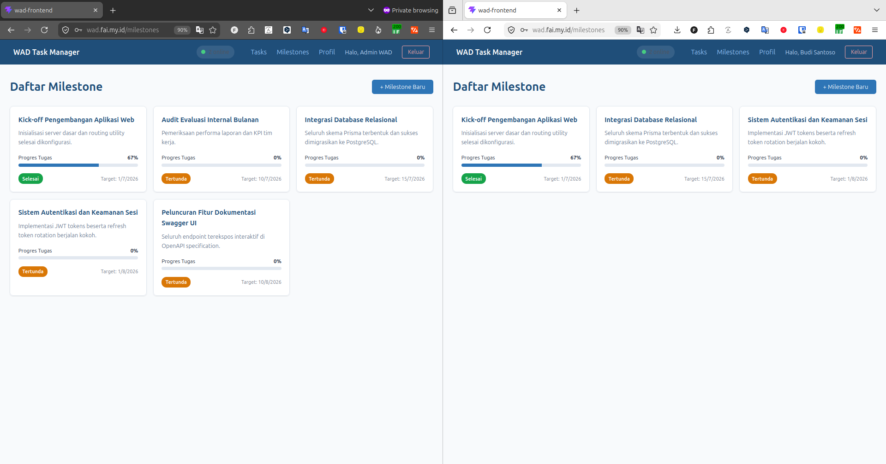
  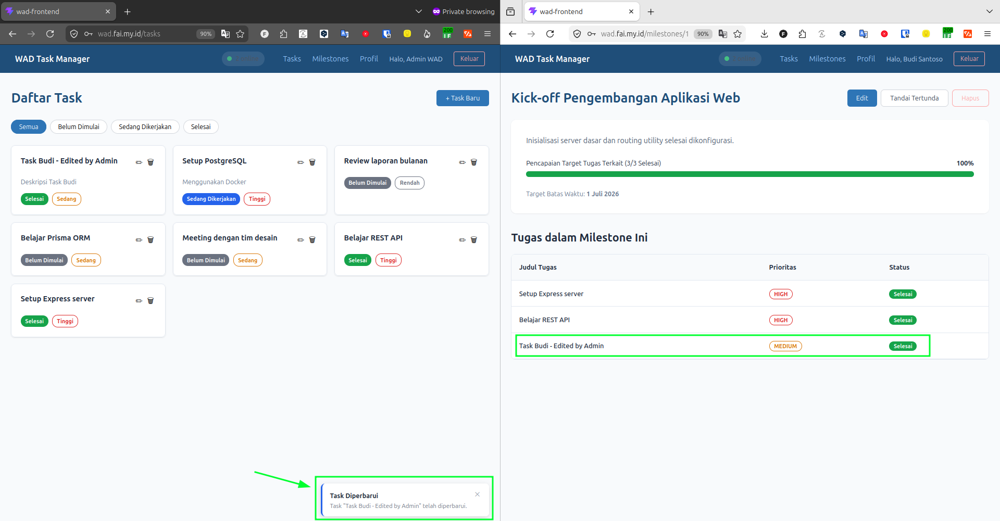
</p>

### Deployment & Infrastructure

<p align="center">
  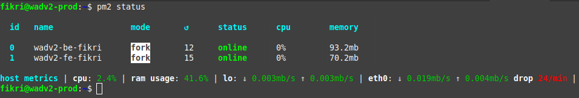
  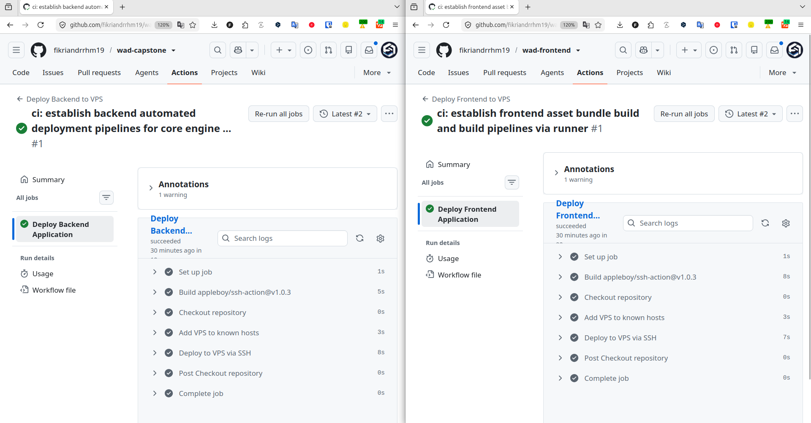
</p>

## Local Development Setup

Ikuti langkah berikut untuk menjalankan backend di environment *development*.

### Prasyarat

Pastikan perangkat telah memenuhi kebutuhan berikut:

- Node.js **v20** atau lebih baru
- PostgreSQL **v15+**
- Git
- npm
- Frontend (`wad-frontend`) berjalan pada `http://localhost:5173` apabila ingin melakukan pengujian integrasi

### 1. Clone Repository

```bash
git clone https://github.com/fikriandrrhm19/wad-capstone.git
cd wad-capstone
```

### 2. Install Dependencies

Install seluruh package yang dibutuhkan aplikasi.

```bash
npm install
```

### 3. Konfigurasi Environment Variables

Buat file `.env` pada direktori root proyek.

```
cp .env.example .env
```

> Sesuaikan value `DATABASE_URL` dengan konfigurasi PostgreSQL pada environment lokal Anda.

### 4. Inisialisasi Database

Pastikan service PostgreSQL telah berjalan, kemudian jalankan migrasi database.

```bash
npx prisma migrate dev
```

Generate Prisma Client.

```bash
npx prisma generate
```

Selanjutnya isi database dengan data awal (*seed*).

```bash
npx prisma db seed
```

### 5. Running Aplikasi

Jalankan backend pada mode development.

```bash
npm run dev
```

Secara default aplikasi akan tersedia di alamat berikut:

| Service | URL |
|---------|-----|
| REST API | http://localhost:3000 |
| Swagger UI | http://localhost:3000/api/docs |
| Health Check | http://localhost:3000/health |

### 6. Verifikasi Instalasi

Pastikan aplikasi berhasil berjalan dengan mengakses endpoint berikut: `GET http://localhost:3000/health`

Apabila backend berhasil dijalankan, endpoint tersebut akan mengembalikan status HTTP `200 OK`.

Swagger UI juga dapat diakses melalui: `http://localhost:3000/api/docs`


## API Testing (Postman)

Direktori `postman_collections/` berisi kumpulan **Postman Collection** yang dapat digunakan untuk menguji seluruh endpoint REST API selama proses development.

- `WAD-Capstone-Lab1-6.postman_collection.json` — Endpoint praktikum Week 1-6
- `WAD-Capstone-Lab-7.postman_collection.json` — Endpoint autentikasi, RBAC, dan security
- `WAD-Capstone-UTS.postman_collection.json` — Endpoint lengkap sesuai implementasi UTS

Seluruh koleksi dapat di-import langsung ke Postman melalui menu **Import** untuk mempermudah pengujian endpoint.

## License

Proyek ini menggunakan lisensi **MIT License**. Lihat file [`LICENSE`](./LICENSE) untuk informasi selengkapnya.